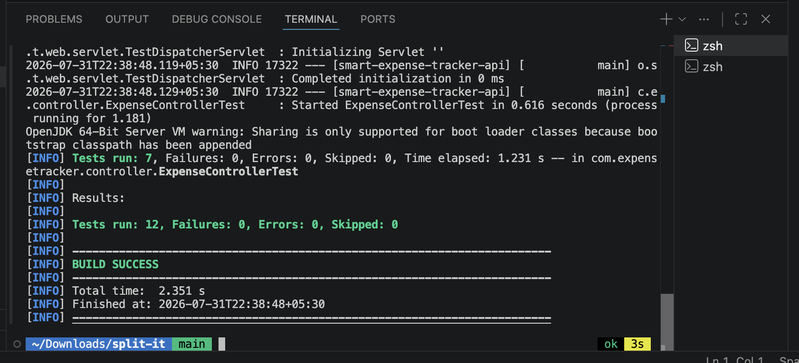

# Split-it (Smart Expense Tracker API)

A production-grade REST API built with **Java 17** and **Spring Boot 3** to manage personal expenses. It supports persistent JSON file storage (`data/expenses.json`), category filtering, summary calculations (overall and by category), a bonus monthly summary endpoint, and interactive OpenAPI/Swagger documentation.

---

## Architecture & Folder Structure

To adhere to the automated evaluation requirements while remaining fully compatible with Spring Boot and Maven, this repository uses a custom source/test directory mapping configured in `pom.xml`:
```
split-it/
├── README.md              # Installation, server startup, and test commands
├── AI_NOTES.md            # Required AI usage documentation
├── pom.xml                # Maven build configuration (sourceDirectory=src, testSourceDirectory=tests)
├── mvnw / mvnw.cmd        # Bundled Maven wrapper scripts (no global Maven install required)
├── src/                   # Application source code (com.expensetracker...)
└── tests/                 # JUnit 5 & MockMvc test suite
```



---

## Prerequisites

- **Java 17 or higher** installed (`java -version`).
- No global Maven installation is required; the included **Maven Wrapper (`./mvnw`)** will automatically download and use the correct Maven version.

---

## 1. Install Dependencies & Build

To download all required dependencies and compile the project:

```bash
# On Linux / macOS
./mvnw clean compile

# On Windows (Command Prompt / PowerShell)
mvnw.cmd clean compile
```

---

## 2. Run the Server

To start the Spring Boot REST API server:

```bash
# On Linux / macOS
./mvnw spring-boot:run

# On Windows (Command Prompt / PowerShell)
mvnw.cmd spring-boot:run
```

- The API server starts on **`http://localhost:8080`**.
- Data is automatically stored and persisted in **`data/expenses.json`**.
- **Interactive OpenAPI/Swagger Docs**: Open **[http://localhost:8080/swagger-ui.html](http://localhost:8080/swagger-ui.html)** in your browser to test endpoints interactively.

---

## 3. Run the Test Suite

To run the automated JUnit 5 and Spring Boot MockMvc tests:

```bash
# On Linux / macOS
./mvnw test

# On Windows (Command Prompt / PowerShell)
mvnw.cmd test
```

The test suite runs with an isolated temporary JSON file (`target/test-data/test-expenses.json`) and verifies:
- Expense creation and input validation (`400 Bad Request` on invalid payloads).
- Fetching all expenses and case-insensitive category filtering (`?category=...`).
- Overall total and category-wise breakdown calculations (`/api/v1/expenses/summary`).
- Monthly summary grouping and calculations (`/api/v1/expenses/summary/monthly`).
- Proper error handling (`404 Not Found` for missing IDs).

---

## 4. (Bonus / Optional) Run with Docker Compose

If you prefer running the application as a containerized Docker service without installing a local JVM:

```bash
# Start container in detached mode using Docker Compose
docker compose up -d

# View container logs
docker compose logs -f

# Stop container
docker compose down
```
- Uses a single standalone `docker-compose.yml` file with the official `eclipse-temurin:17-jdk-jammy` image.
- Automatically mounts the project and persists data on your host machine in `data/expenses.json`.

---

## 5. Postman Collection & Cloud Testing

- **Option A (Direct File Import - Recommended & Free)**: An automated Postman collection file is included in the project root: **`split-it.postman_collection.json`**. Simply click **Import** in Postman and select this file to start testing instantly.
- **Option B (Postman Cloud Workspace Link)**:
  - You can also view the collection via our Postman Cloud workspace:  
    [Smart Expense Tracker Postman Collection](https://rosh223176-1877132.postman.co/workspace/9a37ba13-0a4d-48dd-85e5-14b99bffa51d/collection/56118617-0a9a8f83-347d-431f-bfac-08cf6706b282?action=share&source=copy-link&creator=56118617)
  - *Note: When you click the link above, a Postman popup will appear asking to **Request Access**. Simply click **Request Access** and I will approve your access request for free.*

---

## API Reference & Examples

### 1. Add an Expense
```bash
curl -X POST http://localhost:8080/api/v1/expenses \
  -H "Content-Type: application/json" \
  -d '{
    "title": "Grocery Shopping",
    "amount": 54.75,
    "category": "Food",
    "date": "2026-07-31"
  }'
```
*Returns `201 Created` with the full generated expense object including UUID `id`.*

### 2. View All Expenses (Optional Category Filter)
```bash
# View all
curl -X GET http://localhost:8080/api/v1/expenses

# Filter by category
curl -X GET "http://localhost:8080/api/v1/expenses?category=Food"
```

### 3. Get Expense Summary (Total & Category Breakdown)
```bash
curl -X GET http://localhost:8080/api/v1/expenses/summary
```
*Example Response:*
```json
{
  "totalAmount": 54.75,
  "categoryBreakdown": {
    "Food": 54.75
  }
}
```

### 4. Get Monthly Expense Summary (Bonus Feature)
```bash
curl -X GET http://localhost:8080/api/v1/expenses/summary/monthly
```
*Example Response:*
```json
[
  {
    "month": "2026-07",
    "totalAmount": 54.75,
    "expenseCount": 1,
    "categoryBreakdown": {
      "Food": 54.75
    }
  }
]
```

### 5. View Single Expense by ID
```bash
curl -X GET http://localhost:8080/api/v1/expenses/{id}
```

### 6. Delete an Expense by ID
```bash
curl -X DELETE http://localhost:8080/api/v1/expenses/{id}
```
*Returns `204 No Content` on success.*
